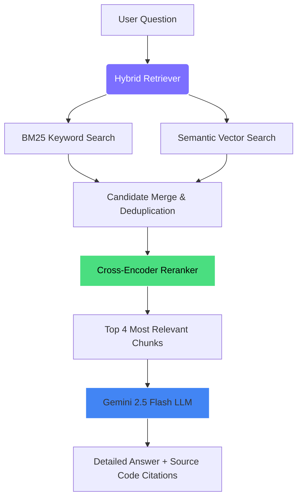

# 🐱 Gitty — AI-Powered GitHub Repo & Local Codebase Reader

[](https://www.python.org/)
[](https://fastapi.tiangolo.com/)
[](https://aistudio.google.com/)
[](https://www.trychroma.com/)

**Gitty** is a production-quality RAG (Retrieval-Augmented Generation) system that allows you to ask plain-English questions about any GitHub repository or local code folder. 

No more spending hours reading through unfamiliar codebases. Point Gitty at any local folder, and it will index all files, understand the project architecture, and answer questions like a senior developer who knows the entire codebase.

---

## 📸 Showcase & User Interface

Here is a visual walkthrough of Gitty in action. You can save your screenshots inside the [`assets/`](./assets/) folder with the names below to render them on GitHub:

### 1. Landing Page (Empty State)
When you first open Gitty, you are greeted with a beautiful glassmorphic dark-theme UI. It checks if the backend is running, displays suggestion chips, and indicates if the server is offline or online.


### 2. Indexing a Project
Simply paste the path to your local folder. Gitty automatically walks the directory, filters out junk files, chunks the code, generates embeddings, and saves them to a local database.


### 3. High-Level Repository Overview
Ask Gitty broad questions like *"what is this repo about"* or *"explain the structure."* It reads the files, summarizes the project, and references the exact files and lines of code it analyzed.


### 4. Technical Architecture Questions
Ask specific architectural questions. Here, Gitty explains how the codebase handles real-time coordinates using Socket.io, showing code snippets and file paths.


### 5. Detailed Code Workflows
Ask Gitty to trace complex workflows across multiple files. It breaks down the workflow step-by-step with file names, socket events, and corresponding logic.


---

## 🧠 How Gitty Works (Under the Hood)

Gitty uses a state-of-the-art **Hybrid Search + Reranking RAG pipeline** to ensure Gemini always receives the most relevant parts of your code.



1. **Smart File Parser:** Walks the codebase and extracts clean UTF-8 text from code files (supporting Python, JS, TS, React, HTML, CSS, C++, Go, Rust, etc.). It automatically skips binaries and junk folders like `.git`, `node_modules`, and `venv`.
2. **Dynamic Code Chunking:** Splitting files using LangChain's `RecursiveCharacterTextSplitter` into overlapping chunks of 800 characters, prioritizing splits at class and function boundaries.
3. **Local Embedding Generation:** Converts code chunks into mathematical vectors using a free, local model (`sentence-transformers/all-MiniLM-L6-v2`) running on your CPU.
4. **Hybrid Retrieval:** When you ask a question, Gitty performs two searches in parallel:
   * **Semantic Search:** Finds code with similar *meaning* using Chroma Vector DB.
   * **Keyword Search (BM25):** Finds exact matching terms (great for searching specific function or variable names).
5. **Cross-Encoder Reranking:** Takes the merged search results and re-scores them using a deep learning reranker (`cross-encoder/ms-marco-MiniLM-L-6-v2`) to pick the top 4 most relevant chunks.
6. **Gemini Generation:** Passes the top chunks to **Gemini 2.5 Flash** as context. Gemini reads the code and constructs a complete, accurate markdown answer.

---

## ⚡ Quick Start

### Prerequisites
*   **Python 3.11** (Recommended)
*   A **Gemini API Key** (Get one for free at [Google AI Studio](https://aistudio.google.com/app/apikey))

### 1. Setup the Codebase
Clone Gitty and open a terminal in the folder:

```bash
# Create a virtual environment
python -m venv venv

# Activate the virtual environment
# On Windows:
.\venv\Scripts\Activate.ps1
# On Mac/Linux:
source venv/bin/activate

# Install all requirements
pip install -r requirements.txt
```

### 2. Configure Environment Variables
Create a file named `.env` in the root directory:

```env
GEMINI_API_KEY=AIzaSyYourGeminiApiKeyHere
GEMINI_MODEL=gemini-2.5-flash
ANON_TELEMETRY=False
```
*(Do not put quotation marks around the API key or model name).*

### 3. Start Gitty
Run the backend server:
```bash
python main.py
```
You should see the startup message:
```text
[✓] Environment loaded
[→] Starting API server on http://localhost:8000
```

### 4. Open the Interface
Navigate to the `frontend/` folder and double-click **`index.html`** to open the web interface in your browser.

---

## 🔌 API Reference

Gitty exposes a clean REST API using FastAPI. You can access the interactive Swagger documentation at `http://localhost:8000/docs`.

| Endpoint | Method | Description | Request Body / Response |
| :--- | :---: | :--- | :--- |
| `/health` | `GET` | Checks server status and index readiness | Returns connection and chunk count |
| `/index` | `POST` | Wipes the old database and indexes a new local folder | `{"folder_path": "C:/path/to/project"}` |
| `/ask` | `POST` | Sends query, retrieves context, and answers | `{"query": "Where is the auth logic?"}` |
| `/status` | `GET` | Returns details about the currently indexed codebase | Returns folder path and total chunks |

---

## 🛠 Project Structure

```text
gitty/
├── backend/
│   ├── __init__.py
│   ├── api.py           # FastAPI Web Server (exposes routes & starts server)
│   └── rag_engine.py    # Core RAG logic (parsing, chunking, retrieval, Gemini call)
├── frontend/
│   └── index.html       # Glassmorphism Browser UI
├── assets/
│   └── .gitkeep         # Stores screenshots for the README
├── .env                 # Environment config (API key, model)
├── .gitignore           # Git ignore rules (ignores .env, venv/, and chroma_db/)
├── requirements.txt     # Python dependencies
├── main.py              # Entry point to load env and launch server
└── README.md            # This documentation file
```

---

## 📝 License
This project is licensed under the MIT License. Feel free to use and modify it.
